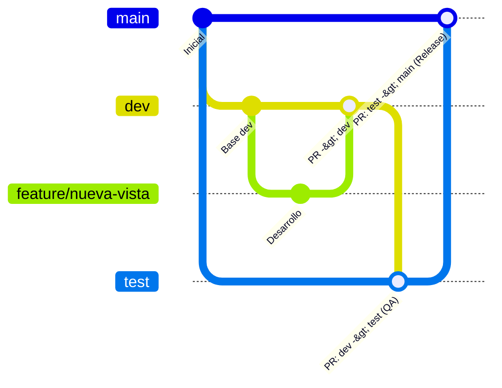

# SIFYGSA-BUSINESS-SUITE

Plataforma integral de gestión y servicios para **SIFYGSA**.

---

## 📌 Flujo de Trabajo y Gestión de Ramas

Para garantizar la estabilidad del software, la trazabilidad del código y despliegues seguros, este repositorio utiliza un flujo basado en entornos escalonados:

$$\mathbf{feature} \longrightarrow \mathbf{dev} \longrightarrow \mathbf{test} \longrightarrow \mathbf{main}$$

---

### 🗺️ Mapa de Ramas y Entornos

| Rama | Entorno | Propósito | Acceso / Modificación |
| :--- | :--- | :--- | :--- |
| **`main`** | **Producción** | Código 100% estable, auditado y listo para usuarios finales. | 🔒 **Solo PR** desde `test` o `hotfix/*`. Push directo bloqueado. |
| **`test`** | **QA / Pruebas** | Entorno de validación funcional, pruebas de integración y control de calidad. | 🔒 **Solo PR** desde `dev`. Push directo bloqueado. |
| **`dev`** | **Desarrollo** | Integración continua de nuevas características del equipo de desarrollo. | 🔒 **Solo PR** desde ramas de trabajo (`feature/*`, `fix/*`). |
| **`feature/*`** | Local / Remoto | Desarrollo de nuevas funcionalidades o módulos individuales. | Creada por cada colaborador desde `dev`. |
| **`fix/*`** | Local / Remoto | Corrección de incidencias detectadas en `dev` o `test`. | Creada por cada colaborador desde `dev`. |
| **`hotfix/*`** | Local / Remoto | Corrección crítica urgente sobre errores en producción (`main`). | Creada desde `main`. |

---

### 🔄 Diagrama del Flujo



---

## 🚀 Guía Paso a Paso para Colaboradores

### 1. Iniciar una nueva tarea o corrección
Cualquier nueva característica o corrección ordinaria **siempre debe iniciar a partir de la versión más reciente de `dev`**:

```bash
# 1. Posicionarse en dev y sincronizar cambios remotos
git checkout dev
git pull origin dev

# 2. Crear una rama de trabajo con un nombre descriptivo
git checkout -b feature/nombre-de-la-funcionalidad
# o para correcciones:
git checkout -b fix/descripcion-del-error
```

> **Convención para nombres de ramas:**
> - `feature/<modulo-o-funcionalidad>` (ej. `feature/login-jwt`, `feature/tabla-usuarios`)
> - `fix/<descripcion-del-bug>` (ej. `fix/calculo-iva`, `fix/scroll-modal`)
> - `hotfix/<urgencia>` (ej. `hotfix/error-sesion-produccion`)

---

### 2. Guardar cambios y estándar de Commits
Se recomienda aplicar la convención **Conventional Commits**:

```bash
git add .
git commit -m "feat(auth): implementar middleware de autenticación"
```

Prefijos estándar recomendados:
- `feat:` Nueva funcionalidad o módulo.
- `fix:` Corrección de un error/bug.
- `docs:` Cambios o adición de documentación.
- `style:` Formato, punto y coma, estilos (sin cambio en la lógica).
- `refactor:` Refactorización de código sin alterar su comportamiento.
- `test:` Adición o corrección de pruebas unitarias o de integración.
- `chore:` Tareas de mantenimiento, dependencias o configuración del proyecto.

---

### 3. Paso 1: Subir cambios y solicitar integración a `dev`
Una vez completada la tarea en local:

```bash
# Subir la rama al repositorio remoto
git push -u origin feature/nombre-de-la-funcionalidad
```

1. Ve a GitHub y crea un **Pull Request (PR)**:
   - **Base:** `dev` $\longleftarrow$ **Compare:** `feature/nombre-de-la-funcionalidad`
2. Describe claramente los cambios realizados, componentes afectados y capturas si aplica.
3. Solicita revisión de al menos un compañero o líder técnico (**Code Review**).
4. Tras la aprobación, se realiza el **Merge** a `dev`.

---

### 4. Paso 2: Promoción a `test` (Pruebas / QA)
Cuando las tareas integradas en `dev` conforman un paquete o sprint listo para pruebas:

1. El líder o encargado abre un **Pull Request**:
   - **Base:** `test` $\longleftarrow$ **Compare:** `dev`
   - **Título sugerido:** `Release Candidate: Sprint X / Módulos Y`
2. Una vez aprobado y fusionado, el entorno de pruebas (`test`) queda actualizado para validación por parte del equipo de control de calidad o usuarios clave.
3. Si durante las pruebas en `test` surgen fallos:
   - Se crea una rama `fix/*` partiendo de `dev`.
   - Se sube a `dev` mediante PR.
   - Se vuelve a promover `dev` a `test`.

---

### 5. Paso 3: Promoción a `main` (Producción)
Una vez que el paquete ha sido probado y certificado en `test`:

1. Se abre el **Pull Request final**:
   - **Base:** `main` $\longleftarrow$ **Compare:** `test`
   - **Título sugerido:** `Release vX.Y.Z`
2. Requiere aprobación formal antes de fusionarse.
3. Al integrarse a `main`, el cambio se considera desplegado o listo para despliegue productivo.
4. **Buenas prácticas (Versionado):** Crear una etiqueta de versión (*Tag*) en `main`:
   ```bash
   git checkout main
   git pull origin main
   git tag -a v1.0.0 -m "Versión 1.0.0 puesta en producción"
   git push origin v1.0.0
   ```

---

### 6. Casos Especiales: Manejo de `hotfix` (Urgencias en Producción)
Si se presenta una falla crítica directamente en producción (`main`) que no puede esperar el ciclo ordinario de sprint:

```bash
# 1. Crear rama directamente desde main actualizado
git checkout main
git pull origin main
git checkout -b hotfix/solucion-urgente

# 2. Realizar corrección y subir
git commit -m "fix(prod): resolver caída de pasarela de pagos"
git push -u origin hotfix/solucion-urgente
```

1. Abrir PR directo: **Base:** `main` $\longleftarrow$ **Compare:** `hotfix/solucion-urgente`.
2. Una vez fusionado en `main`, **es obligatorio replicar el parche** hacia `test` y `dev` para evitar regresiones:
   ```bash
   # Sincronizar test
   git checkout test
   git pull origin test
   git merge main
   git push origin test

   # Sincronizar dev
   git checkout dev
   git pull origin dev
   git merge main
   git push origin dev
   ```

---

## 🛡️ Políticas de Protección de Ramas (GitHub Settings)

Para asegurar el cumplimiento de este flujo, se establecen las siguientes reglas en GitHub:
1. **Push directo denegado** en `main`, `test` y `dev`.
2. **Revisión obligatoria (Code Review):** Al menos 1 aprobación requerida en cada Pull Request.
3. **Historial limpio:** Se descartan aprobaciones previas si se agregan nuevos commits a un PR activo.
4. **Sin excepciones:** Las reglas aplican a todos los miembros del equipo.
